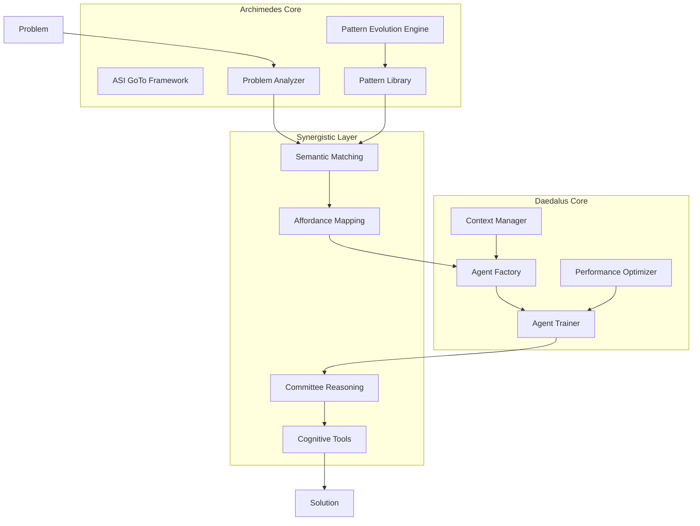

# Archimedes-Daedalus Synergistic System Specification

**Version:** 1.0  
**Date:** 2025-09-27  
**Status:** Draft  
**Priority:** High  

---

## 1. Overview & Context

### 1.1 System Purpose

The Archimedes-Daedalus synergistic system represents a revolutionary approach to artificial general intelligence that combines rapid pattern matching and evolution (Archimedes) with specialized agent development and optimization (Daedalus). This system extends the existing ASI GoTo framework to create a self-improving, problem-solving architecture capable of handling novel challenges through dynamic adaptation and specialized agent coordination.

### 1.2 Architectural Vision

```
┌─────────────────────────────────────────────────────────────────┐
│                    ARCHIMEDES-DAEDALUS ECOSYSTEM               │
├─────────────────────────────────────────────────────────────────┤
│  ┌─────────────────┐                    ┌─────────────────┐     │
│  │   ARCHIMEDES    │◄──────────────────►│    DAEDALUS     │     │
│  │                 │   Semantic          │                 │     │
│  │ Pattern Master  │   Similarity        │ Agent Architect │     │
│  │ Problem Solver  │   Matching          │ Specialist Dev  │     │
│  │ Rapid Evolution │                     │ Context Master  │     │
│  └─────────────────┘                    └─────────────────┘     │
│           │                                       │             │
│           ▼                                       ▼             │
│  ┌─────────────────────────────────────────────────────────────┐ │
│  │              AFFORDANCE MAPPING SYSTEM                     │ │
│  │        Problem-Agent Semantic Similarity Matching         │ │
│  └─────────────────────────────────────────────────────────────┘ │
│                                │                                │
│                                ▼                                │
│  ┌─────────────────────────────────────────────────────────────┐ │
│  │              COMMITTEE REASONING ENGINE                    │ │
│  │         IBM Cognitive Tools + Tree of Thought             │ │
│  └─────────────────────────────────────────────────────────────┘ │
└─────────────────────────────────────────────────────────────────┘
```

### 1.3 Core Philosophy

- **Synergistic Intelligence**: Archimedes and Daedalus operate as complementary systems, each enhancing the other's capabilities
- **Rapid Adaptation**: Novel problems trigger immediate pattern evolution and agent specialization
- **Semantic Coherence**: All problem-agent matching is based on deep semantic understanding
- **Committee Cognition**: Multiple reasoning perspectives ensure robust solution development
- **Subspecialty Excellence**: Agents maintain refined contexts optimized for their specific domains

---

## Clarifications

### Session 2025-09-27
- Q: Which specific IBM cognitive tools framework should be integrated? → A: Research papers on cognitive tools for problem-solving (e.g., specific methodologies)
- Q: Which semantic similarity computation method should be used for problem-agent matching? → A: Existing Vector Database system
- Q: What selection criteria should guide agent mutation and evolution? → A: Domain-specific accuracy metrics combined with resource efficiency
- Q: What problem complexity scale should the system optimize for? → A: Variable complexity: adaptive system handling all levels dynamically
- Q: How should agent subspecialty domains be scoped and bounded? → A: Dynamic domains emerging from problem clustering and usage patterns

---

## 2. Functional Requirements

### 2.1 Archimedes Core Functions (FR-A)

**FR-A.1: ASI GoTo Framework Integration**
- MUST integrate all ASI GoTo components: Researcher, Engineer, Analyst, Memory Systems
- MUST preserve existing cognitive core functionality and memory system architecture
- MUST extend with rapid pattern matching capabilities for novel problem recognition
- MUST maintain backward compatibility with existing ASI GoTo workflows

**FR-A.2: Rapid Pattern Matching System**
- MUST detect novel problem patterns within 100ms of problem presentation
- MUST maintain a dynamic pattern library with confidence scoring and success tracking
- MUST support hierarchical pattern relationships and inheritance
- MUST provide pattern similarity scoring using semantic embeddings

**FR-A.3: Pattern Evolution Engine**
- MUST adapt existing patterns based on solution success/failure feedback
- MUST generate new patterns through compositional combination of existing patterns
- MUST support real-time pattern mutation and selection based on problem context
- MUST maintain pattern genealogy for explainability and debugging

**FR-A.4: Problem Decomposition and Analysis**
- MUST break complex problems into solvable sub-components
- MUST identify required expertise domains for each sub-component
- MUST generate semantic fingerprints for problem-agent matching
- MUST provide confidence estimates for problem tractability

### 2.2 Daedalus Core Functions (FR-D)

**FR-D.1: Agent Development and Optimization**
- MUST create specialized agents for identified problem domains
- MUST optimize agent performance through continuous learning and adaptation
- MUST maintain agent context refinement for subspecialty expertise
- MUST support agent composition and coordination for complex tasks

**FR-D.2: Agent Mutation and Training**
- MUST implement genetic algorithm-style agent evolution using domain-specific accuracy metrics combined with resource efficiency as selection criteria
- MUST support supervised and reinforcement learning for agent improvement
- MUST maintain agent population diversity to prevent premature convergence
- MUST provide agent performance benchmarking and comparison

**FR-D.3: Context Specialization Management**
- MUST maintain refined contexts for each agent subspecialty
- MUST dynamically adjust context boundaries based on problem domain evolution
- MUST support context inheritance and sharing between related agents
- MUST provide context conflict resolution for overlapping domains

**FR-D.4: Agent Lifecycle Management**
- MUST support agent creation, versioning, retirement, and archival
- MUST maintain agent performance histories and capability profiles
- MUST provide agent resource allocation and scheduling
- MUST support agent collaboration protocols and communication standards

### 2.3 Synergistic Integration Functions (FR-S)

**FR-S.1: Semantic Similarity Matching**
- MUST leverage existing Vector Database system for semantic embedding-based problem-agent matching
- MUST support multi-modal problem representations (text, code, diagrams)
- MUST provide confidence scoring for match quality
- MUST support batch matching for complex multi-agent problems

**FR-S.2: Affordance Mapping System**
- MUST map problem affordances to agent capabilities
- MUST support contextual affordance detection based on problem environment
- MUST provide dynamic affordance updates as problems evolve
- MUST maintain affordance history for learning and optimization

**FR-S.3: Committee Reasoning Integration**
- MUST implement IBM cognitive tools from arXiv:2506.12115v1: understand_question, recall_related, examine_answer, and backtracking
- MUST integrate Tree of Thought exploration for creative problem solving
- MUST support multi-agent committee formation for complex problems
- MUST provide reasoning transparency and explainability

---

## 3. Non-Functional Requirements

### 3.1 Performance Requirements

**NFR-P.1: Response Time (Adaptive to Variable Complexity)**
- Pattern matching: ≤ 100ms for novel problem recognition across all complexity levels
- Agent matching: ≤ 500ms for multi-domain problems, adaptive scaling for variable complexity
- Committee formation: ≤ 2s for complex reasoning scenarios, dynamic based on problem requirements
- End-to-end problem solving: ≤ 30s for simple problems, ≤ 5min for medium complexity, ≤ 15min for research-level problems

**NFR-P.2: Throughput**
- MUST support ≥ 1000 concurrent problem-solving sessions
- MUST handle ≥ 10,000 pattern matching operations per second
- MUST support ≥ 100 simultaneous agent training processes
- MUST maintain ≤ 95th percentile response times under peak load

**NFR-P.3: Scalability**
- MUST scale horizontally to 100+ processing nodes
- MUST support elastic scaling based on problem complexity and load
- MUST maintain consistent performance across scaling events
- MUST support distributed agent deployment and coordination

### 3.2 Reliability Requirements

**NFR-R.1: Availability**
- MUST maintain 99.9% uptime for core problem-solving functionality
- MUST support graceful degradation when individual agents are unavailable
- MUST provide automatic failover for critical system components
- MUST maintain service during rolling updates and maintenance

**NFR-R.2: Fault Tolerance**
- MUST recover from individual agent failures without system impact
- MUST support pattern library corruption recovery
- MUST provide transaction-level atomicity for agent updates
- MUST maintain consistency across distributed agent populations

**NFR-R.3: Data Integrity**
- MUST ensure pattern library consistency across all nodes
- MUST maintain agent context integrity during updates
- MUST provide audit trails for all agent modifications
- MUST support point-in-time recovery for critical system states

### 3.3 Security Requirements

**NFR-S.1: Access Control**
- MUST implement role-based access control for agent management
- MUST provide secure agent communication protocols
- MUST encrypt all inter-agent communications
- MUST support agent capability sandboxing

**NFR-S.2: Data Protection**
- MUST encrypt all pattern data at rest and in transit
- MUST implement secure key management for agent contexts
- MUST provide data anonymization for sensitive problem domains
- MUST support compliance with data protection regulations

---

## 4. User Stories

### 4.1 Archimedes User Stories

**US-A.1: Novel Problem Recognition**
```
As a problem requester
I want Archimedes to immediately recognize when I present a problem it hasn't seen before
So that it can rapidly develop new solution approaches without getting stuck in existing patterns
```

**US-A.2: Pattern Evolution Learning**
```
As a system administrator
I want Archimedes to automatically improve its problem-solving patterns based on success/failure feedback
So that the system becomes more effective over time without manual intervention
```

**US-A.3: Rapid Problem Decomposition**
```
As a domain expert
I want Archimedes to quickly break down complex problems into manageable components
So that I can understand the solution approach and validate the decomposition strategy
```

### 4.2 Daedalus User Stories

**US-D.1: Specialized Agent Development**
```
As a domain specialist
I want Daedalus to create highly specialized agents for my specific problem domain
So that I can achieve better performance than general-purpose AI systems
```

**US-D.2: Agent Performance Optimization**
```
As a performance engineer
I want Daedalus to continuously optimize agent performance through learning and adaptation
So that solution quality improves over time without manual tuning
```

**US-D.3: Context Refinement**
```
As an agent developer
I want Daedalus to maintain and refine agent contexts for subspecialty expertise
So that agents can handle domain-specific nuances and edge cases effectively
```

### 4.3 Synergistic System User Stories

**US-S.1: Semantic Problem-Agent Matching**
```
As a problem requester
I want the system to automatically match my problem with the most suitable specialized agents
So that I get the highest quality solution without needing to understand agent capabilities
```

**US-S.2: Committee Reasoning for Complex Problems**
```
As a researcher
I want multiple specialized agents to collaborate on complex problems using validated cognitive tools
So that I can benefit from diverse perspectives and enhanced reasoning capabilities
```

**US-S.3: Adaptive Problem Solving**
```
As a business user
I want the system to adapt its problem-solving approach based on the specific characteristics of my problem
So that I get optimal solutions regardless of problem novelty or complexity
```

---

## 5. Technical Architecture

### 5.1 System Components

#### 5.1.1 Archimedes Core Architecture

```python
class ArchimedesCore:
    """
    Archimedes core system integrating ASI GoTo framework with rapid pattern evolution
    """
    def __init__(self):
        # ASI GoTo Integration
        self.asi_goto_foundation = ASIGoToFramework()
        self.researcher = self.asi_goto_foundation.researcher
        self.engineer = self.asi_goto_foundation.engineer
        self.analyst = self.asi_goto_foundation.analyst
        self.memory_system = self.asi_goto_foundation.memory_system
        
        # Archimedes Extensions
        self.pattern_library = RapidPatternLibrary()
        self.pattern_evolution_engine = PatternEvolutionEngine()
        self.problem_analyzer = SemanticProblemAnalyzer()
        self.cognitive_enhancer = CognitiveToolsIntegration()
        
    async def solve_novel_problem(self, problem: Problem) -> Solution:
        """Main entry point for novel problem solving"""
        pass
```

#### 5.1.2 Daedalus Agent Architecture

```python
class DaedalusAgentOrchestrator:
    """
    Daedalus system for specialized agent development and optimization
    """
    def __init__(self):
        self.agent_factory = SpecializedAgentFactory()
        self.agent_trainer = AgentTrainingEngine()
        self.context_manager = SubspecialtyContextManager()
        self.performance_optimizer = AgentPerformanceOptimizer()
        self.lifecycle_manager = AgentLifecycleManager()
        
    async def create_specialized_agent(self, domain_spec: DomainSpecification) -> SpecializedAgent:
        """Create a new specialized agent for a specific domain"""
        pass
        
    async def optimize_agent_population(self, performance_data: PerformanceMetrics) -> None:
        """Optimize the entire agent population through mutation and selection"""
        pass
```

#### 5.1.3 Semantic Matching and Affordance System

```python
class SemanticAffordanceEngine:
    """
    Semantic similarity matching and affordance mapping between problems and agents
    """
    def __init__(self):
        self.semantic_encoder = MultiModalSemanticEncoder()
        self.affordance_mapper = AffordanceContextService()
        self.similarity_calculator = SemanticSimilarityCalculator()
        self.matching_optimizer = MatchingOptimizer()
        
    async def match_problem_to_agents(self, problem: Problem) -> List[AgentMatch]:
        """Find the best agents for solving a given problem"""
        pass
        
    async def calculate_affordance_compatibility(self, 
                                               problem_affordances: List[Affordance],
                                               agent_capabilities: List[Capability]) -> float:
        """Calculate compatibility between problem affordances and agent capabilities"""
        pass
```

### 5.2 Data Architecture

#### 5.2.1 Pattern Library Schema

```python
@dataclass
class EvolutionaryPattern:
    """Represents a problem-solving pattern that can evolve"""
    pattern_id: str
    name: str
    description: str
    problem_signature: SemanticSignature
    solution_template: SolutionTemplate
    success_rate: float
    confidence_score: float
    generation: int
    parent_patterns: List[str]
    mutation_history: List[Mutation]
    performance_metrics: PerformanceMetrics
    created_at: datetime
    last_updated: datetime
```

#### 5.2.2 Agent Specification Schema

```python
@dataclass
class SpecializedAgent:
    """Represents a specialized agent with refined context"""
    agent_id: str
    name: str
    subspecialty_domain: str
    capability_profile: CapabilityProfile
    context_boundaries: ContextBoundaries
    training_data: TrainingDataset
    performance_history: PerformanceHistory
    mutation_parameters: MutationParameters
    collaboration_protocols: CollaborationProtocols
    resource_requirements: ResourceRequirements
```

#### 5.2.3 Problem-Agent Matching Schema

```python
@dataclass
class ProblemAgentMatch:
    """Represents a semantic match between a problem and an agent"""
    match_id: str
    problem_signature: SemanticSignature
    agent_id: str
    similarity_score: float
    affordance_compatibility: float
    confidence_level: float
    expected_performance: float
    contextual_factors: List[ContextualFactor]
    reasoning_explanation: str
    match_timestamp: datetime
```

### 5.3 Integration Architecture

#### 5.3.1 ASI GoTo Integration Points

```python
class ASIGoToArchimedesIntegration:
    """Integration layer between ASI GoTo and Archimedes enhancements"""
    
    def enhance_researcher_with_patterns(self, researcher: Researcher) -> EnhancedResearcher:
        """Enhance ASI GoTo Researcher with pattern-based solution generation"""
        pass
        
    def enhance_engineer_with_agents(self, engineer: Engineer) -> EnhancedEngineer:
        """Enhance ASI GoTo Engineer with specialized agent coordination"""
        pass
        
    def enhance_analyst_with_committees(self, analyst: Analyst) -> EnhancedAnalyst:
        """Enhance ASI GoTo Analyst with committee reasoning capabilities"""
        pass
```

#### 5.3.2 Cognitive Tools Integration

```python
class CognitiveToolsCommitteeEngine:
    """Integration of IBM-validated cognitive tools with committee reasoning"""
    
    def __init__(self):
        self.cognitive_orchestrator = CognitiveMetaCoordinator()
        self.committee_formation = CommitteeFormationEngine()
        self.reasoning_coordinator = ReasoningCoordinator()
        
    async def form_reasoning_committee(self, 
                                     problem: Problem, 
                                     available_agents: List[Agent]) -> ReasoningCommittee:
        """Form a committee of agents for enhanced reasoning"""
        pass
        
    async def execute_committee_reasoning(self, 
                                        committee: ReasoningCommittee, 
                                        problem: Problem) -> CommitteeReasoning:
        """Execute committee-based reasoning with cognitive tools"""
        pass
```

---

## 6. Implementation Plan

### 6.1 Phase 1: Foundation Integration (Weeks 1-4)

**Phase 1.1: ASI GoTo Framework Enhancement**
- Extend existing ASI GoTo core with Archimedes pattern recognition
- Implement pattern library data structures and basic CRUD operations
- Create semantic problem analysis integration points
- Establish baseline performance metrics

**Phase 1.2: Basic Semantic Matching**
- Implement semantic embedding generation for problems and solutions
- Create basic similarity calculation algorithms
- Develop problem signature extraction capabilities
- Build initial affordance detection framework

**Phase 1.3: Daedalus Agent Foundation**
- Design specialized agent architecture and interfaces
- Implement basic agent factory and lifecycle management
- Create agent context management system
- Establish agent performance tracking infrastructure

### 6.2 Phase 2: Pattern Evolution and Agent Training (Weeks 5-8)

**Phase 2.1: Pattern Evolution Engine**
- Implement genetic algorithm-based pattern mutation
- Create pattern performance feedback loops
- Develop pattern combination and inheritance mechanisms
- Build pattern library optimization algorithms

**Phase 2.2: Agent Training and Optimization**
- Implement agent training pipelines with various learning algorithms
- Create agent performance optimization through hyperparameter tuning
- Develop agent mutation and selection mechanisms
- Build agent population diversity management

**Phase 2.3: Enhanced Semantic Matching**
- Upgrade semantic matching with multi-modal support
- Implement confidence scoring for problem-agent matches
- Create contextual affordance detection and mapping
- Develop dynamic matching optimization based on performance feedback

### 6.3 Phase 3: Committee Reasoning and Advanced Features (Weeks 9-12)

**Phase 3.1: Cognitive Tools Integration**
- Integrate IBM-validated cognitive tools with existing cognitive orchestrator
- Implement Tree of Thought exploration for creative problem solving
- Create cognitive tool selection and orchestration algorithms
- Build reasoning transparency and explainability features

**Phase 3.2: Committee Formation and Coordination**
- Implement committee formation algorithms based on problem characteristics
- Create agent collaboration protocols and communication standards
- Develop committee reasoning coordination and consensus mechanisms
- Build committee performance evaluation and optimization

**Phase 3.3: Advanced Adaptation and Learning**
- Implement system-wide learning from problem-solving experiences
- Create adaptive algorithm selection based on problem and context characteristics
- Develop meta-learning capabilities for rapid adaptation to new domains
- Build advanced performance analytics and system optimization

### 6.4 Phase 4: Production Optimization and Deployment (Weeks 13-16)

**Phase 4.1: Performance Optimization**
- Optimize system performance for production workloads
- Implement caching and memoization for frequently accessed patterns and agents
- Create load balancing and scaling algorithms
- Build monitoring and alerting systems

**Phase 4.2: Security and Reliability**
- Implement comprehensive security measures for agent and pattern protection
- Create backup and recovery systems for critical data
- Develop fault tolerance and graceful degradation capabilities
- Build comprehensive testing and validation frameworks

**Phase 4.3: Documentation and Training**
- Create comprehensive system documentation and API references
- Develop user guides and tutorials for different user types
- Build training materials and onboarding processes
- Create maintenance and operational procedures

---

## 7. Success Criteria

### 7.1 Functional Success Criteria

**SC-F.1: Pattern Recognition and Evolution**
- ✅ Novel problem recognition accuracy ≥ 95% within 100ms
- ✅ Pattern evolution shows measurable improvement over time (≥ 10% performance gain per month)
- ✅ Pattern library maintains coherence with ≤ 5% pattern conflicts
- ✅ System generates effective new patterns for ≥ 80% of novel problem types

**SC-F.2: Agent Specialization and Performance**
- ✅ Specialized agents outperform general agents by ≥ 25% in their domains
- ✅ Agent training converges to satisfactory performance in ≤ 100 training iterations
- ✅ Agent context refinement reduces error rates by ≥ 15% compared to baseline
- ✅ Agent population maintains diversity with ≥ 70% unique capability profiles

**SC-F.3: Semantic Matching and Affordance Mapping**
- ✅ Problem-agent matching accuracy ≥ 90% as validated by expert evaluation
- ✅ Semantic similarity scores correlate ≥ 0.85 with human expert assessments
- ✅ Affordance mapping identifies ≥ 95% of relevant agent capabilities for problems
- ✅ Match confidence scores accurately predict actual performance (±10% error)

### 7.2 Performance Success Criteria

**SC-P.1: Response Time Performance**
- ✅ Pattern matching: ≤ 100ms for 95% of requests
- ✅ Agent matching: ≤ 500ms for 95% of complex problems
- ✅ Committee formation: ≤ 2s for 90% of requests
- ✅ End-to-end problem solving: ≤ 30s for routine problems, ≤ 5min for novel problems

**SC-P.2: Throughput and Scalability**
- ✅ Support ≥ 1000 concurrent problem-solving sessions with ≤ 10% performance degradation
- ✅ Scale horizontally to 100+ nodes with linear performance scaling
- ✅ Handle ≥ 10,000 pattern matching operations per second at peak load
- ✅ Support ≥ 100 simultaneous agent training processes

**SC-P.3: Resource Efficiency**
- ✅ Memory usage ≤ 16GB per processing node under normal load
- ✅ CPU utilization ≤ 80% under peak load
- ✅ Network bandwidth usage ≤ 1GB/hour per node for inter-agent communication
- ✅ Storage growth ≤ 100GB/month for pattern and agent data

### 7.3 Quality Success Criteria

**SC-Q.1: Solution Quality**
- ✅ Problem-solving accuracy ≥ 90% as validated by domain experts
- ✅ Committee reasoning produces ≥ 20% better solutions than individual agents
- ✅ Cognitive tools integration improves reasoning quality by ≥ 15%
- ✅ System explanations are rated ≥ 4/5 for clarity and usefulness

**SC-Q.2: System Reliability**
- ✅ System uptime ≥ 99.9% excluding planned maintenance
- ✅ Data consistency maintained across all distributed components
- ✅ Graceful degradation maintains ≥ 80% functionality during component failures
- ✅ Recovery time ≤ 5 minutes for non-catastrophic failures

**SC-Q.3: User Satisfaction**
- ✅ User satisfaction rating ≥ 4.5/5 for problem-solving effectiveness
- ✅ System adoption rate ≥ 80% among target user groups within 6 months
- ✅ User task completion rate ≥ 90% for supported problem types
- ✅ Average user onboarding time ≤ 2 hours to productive use

---

## 8. Risk Assessment and Mitigation

### 8.1 Technical Risks

**Risk T.1: Pattern Library Explosion**
- **Description**: Exponential growth in pattern library size leading to performance degradation
- **Probability**: Medium
- **Impact**: High
- **Mitigation**: Implement pattern pruning algorithms, hierarchical organization, and relevance-based caching

**Risk T.2: Agent Training Instability**
- **Description**: Agent training processes may not converge or may converge to poor local optima
- **Probability**: Medium
- **Impact**: Medium
- **Mitigation**: Implement multiple training algorithms, early stopping criteria, and performance validation gates

**Risk T.3: Semantic Matching Accuracy**
- **Description**: Semantic similarity calculations may not accurately reflect true problem-agent compatibility
- **Probability**: Low
- **Impact**: High
- **Mitigation**: Implement multi-modal embeddings, expert validation datasets, and continuous learning from feedback

### 8.2 Integration Risks

**Risk I.1: ASI GoTo Compatibility**
- **Description**: Archimedes enhancements may break existing ASI GoTo functionality
- **Probability**: Medium
- **Impact**: High
- **Mitigation**: Maintain strict backward compatibility, comprehensive testing, and gradual integration approach

**Risk I.2: Cognitive Tools Integration Complexity**
- **Description**: Integration with cognitive tools may introduce unexpected interactions or performance issues
- **Probability**: Medium
- **Impact**: Medium
- **Mitigation**: Incremental integration, extensive testing, and fallback to direct reasoning when needed

### 8.3 Operational Risks

**Risk O.1: Scaling Challenges**
- **Description**: System may not scale effectively to production workloads
- **Probability**: Low
- **Impact**: High
- **Mitigation**: Performance testing at scale, load testing, and horizontal scaling architecture

**Risk O.2: Data Consistency Issues**
- **Description**: Distributed nature of the system may lead to data consistency problems
- **Probability**: Medium
- **Impact**: Medium
- **Mitigation**: Implement eventual consistency patterns, conflict resolution algorithms, and data validation checks

---

## 9. Appendices

### Appendix A: Glossary

- **Affordance**: An opportunity for action that an environment offers to an agent
- **Agent Mutation**: The process of modifying agent parameters or architecture to improve performance
- **Committee Reasoning**: A collaborative approach where multiple agents contribute to problem solving
- **Pattern Evolution**: The adaptation and improvement of problem-solving patterns over time
- **Semantic Signature**: A high-dimensional vector representation of a problem's semantic content
- **Subspecialty Context**: The refined domain-specific knowledge and constraints that define an agent's expertise

### Appendix B: Reference Architecture Diagrams



### Appendix C: Integration Points with Existing Systems

1. **ASI GoTo Framework**: Direct extension and enhancement of existing components
2. **Cognitive Tools Orchestrator**: Integration with existing cognitive enhancement system
3. **Affordance Context Service**: Extension of existing affordance mapping capabilities
4. **ThoughtSeed System**: Integration with consciousness-guided architecture discovery
5. **Redis and Database Systems**: Leveraging existing data infrastructure for pattern and agent storage

---

**Document Control:**
- **Author**: Dionysus 2.0 Architecture Team
- **Reviewers**: [To be assigned]
- **Approval**: [Pending]
- **Next Review Date**: 2025-10-27
- **Distribution**: Development Team, Product Management, Architecture Review Board